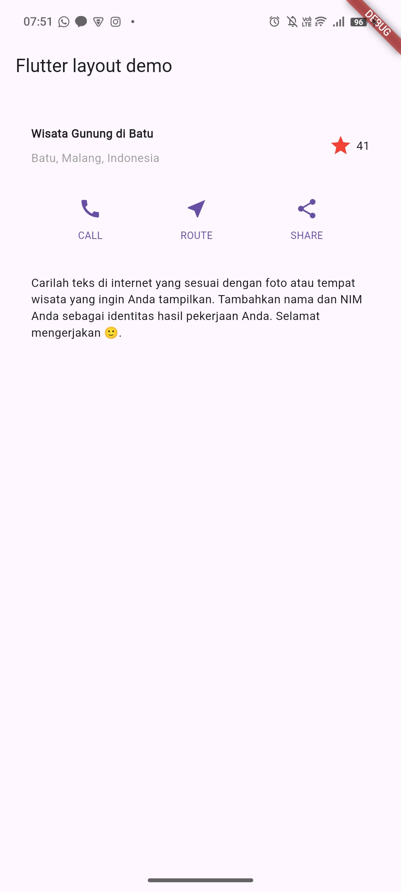

# layout_flutter

**Praktikum 1: Membangun Layout di Flutter**<br>
Output Langkah 2:<br>

<br>

Langkah 4: Implementasi Title Row<br>

```dart
import 'package:flutter/material.dart';

void main() => runApp(const MyApp());

class MyApp extends StatelessWidget {
  const MyApp({super.key});

  Widget get titleSection {
    return Container(
      padding: const EdgeInsets.all(32),
      child: Row(
        children: [
          Expanded(
            child: Column(
              crossAxisAlignment: CrossAxisAlignment.start,
              children: [
                Container(
                  padding: const EdgeInsets.only(bottom: 8),
                  child: const Text(
                    'Wisata Gunung di Batu',
                    style: TextStyle(
                      fontWeight: FontWeight.bold,
                    ),
                  ),
                ),
                const Text(
                  'Batu, Malang, Indonesia',
                  style: TextStyle(
                    color: Colors.grey,
                  ),
                ),
              ],
            ),
          ),
          const Icon(
            Icons.star,
            color: Colors.red,
          ),
          const SizedBox(width: 4),
          const Text('41'),
        ],
      ),
    );
  }

  @override
  Widget build(BuildContext context) {
    return MaterialApp(
      title: 'Flutter layout: Rocky Alessandro Kristanto 2341720197',
      home: Scaffold(
        appBar: AppBar(title: const Text('Flutter layout demo')),
        body: Column(
          children: [
            titleSection,
          ],
        ),
      ),
    );
  }
}
```

Output:
<br>

**Praktikum 2: Implementasi button row**<br>
Langkah 1: Buat method Column \_buildButtonColumn<br>

```dart
Column _buildButtonColumn(Color color, IconData icon, String label) {
    return Column(
      mainAxisSize: MainAxisSize.min,
      mainAxisAlignment: MainAxisAlignment.center,
      children: [
        Icon(icon, color: color),
        Container(
          margin: const EdgeInsets.only(top: 8),
          child: Text(
            label,
            style: TextStyle(
              fontSize: 12,
              fontWeight: FontWeight.w400,
              color: color,
            ),
          ),
        ),
      ],
    );
  }
```

<br>
Langkah 2: Buat widget buttonSection<br>
Tambahkan fungsi berikut dalam metode build():<br>

```dart
  Widget build(BuildContext context) {
    Color color = Theme.of(context).primaryColor;

    Widget buttonSection = Row(
      mainAxisAlignment: MainAxisAlignment.spaceEvenly,
      children: [
        _buildButtonColumn(color, Icons.call, 'CALL'),
        _buildButtonColumn(color, Icons.near_me, 'ROUTE'),
        _buildButtonColumn(color, Icons.share, 'SHARE'),
      ],
    );
    return MaterialApp(
      title: 'Flutter layout: Rocky Alessandro Kristanto 2341720197',
      home: Scaffold(
        appBar: AppBar(title: const Text('Flutter layout demo')),
        body: Column(children: [titleSection]),

      ),
    );
}
```

<br>
Langkah 3: Tambah button section ke body<br>
Tambahkan variabel buttonSection ke dalam body seperti berikut:<br>

```dart
    return MaterialApp(
      title: 'Flutter layout: Rocky Alessandro Kristanto 2341720197',
      home: Scaffold(
        appBar: AppBar(title: const Text('Flutter layout demo')),
        body: Column(children: [titleSection, buttonSection]),
      ),
    );
```

**Praktikum 3: Implementasi text section**

Langkah 1: Buat widget textSection<br>
Tentukan bagian teks sebagai variabel. Masukkan teks ke dalam Container dan tambahkan padding di sepanjang setiap tepinya. Tambahkan kode berikut tepat di bawah deklarasi buttonSection:

```dart
    Widget textSection = Container(
      padding: const EdgeInsets.all(32),
      child: const Text(
        'Carilah teks di internet yang sesuai '
        'dengan foto atau tempat wisata yang ingin '
        'Anda tampilkan. '
        'Tambahkan nama dan NIM Anda sebagai '
        'identitas hasil pekerjaan Anda. '
        'Selamat mengerjakan 🙂.',
        softWrap: true,
      ),
    );
```

Langkah 2: Tambahkan variabel text section ke body<br>
Tambahkan widget variabel textSection ke dalam body seperti berikut:

```dart
    return MaterialApp(
      title: 'Flutter layout: Rocky Alessandro Kristanto 2341720197',
      home: Scaffold(
        appBar: AppBar(title: const Text('Flutter layout demo')),
        body: Column(children: [titleSection, buttonSection, textSection]),
      ),
    );
```

Hasil Output:<br>
<br>

**Praktikum 4: Implementasi image section**<br>

Langkah 1: Siapkan aset gambar
Anda dapat mencari gambar di internet yang ingin ditampilkan. Buatlah folder images di root project layout_flutter. Masukkan file gambar tersebut ke folder images, lalu set nama file tersebut ke file pubspec.yaml seperti berikut:<br>

```yaml
# To add assets to your application, add an assets section, like this:
assets:
  - images/Bliss.png
```

Langkah 2: Tambahkan gambar ke body<br>
Tambahkan aset gambar ke dalam body seperti berikut:

```dart
    return MaterialApp(
      title: 'Flutter layout: Rocky Alessandro Kristanto 2341720197',
      home: Scaffold(
        appBar: AppBar(title: const Text('Flutter layout demo')),
        body: Column(
          children: [
            Image.asset(
              'images/Bliss.png',
              width: 600,
              height: 240,
              fit: BoxFit.cover,
            ),
            titleSection,
            buttonSection,
            textSection,
          ],
        ),
      ),
    );
```

Langkah 3: Terakhir, ubah menjadi ListView<br>
Pada langkah terakhir ini, atur semua elemen dalam ListView, bukan Column, karena ListView mendukung scroll yang dinamis saat aplikasi dijalankan pada perangkat yang resolusinya lebih kecil.

```js
        body: ListView(
          children: [
            Image.asset(
              'images/Bliss.png',
              width: 600,
              height: 240,
              fit: BoxFit.cover,
            ),
            titleSection,
            buttonSection,
            textSection,
          ],
        ),
```
