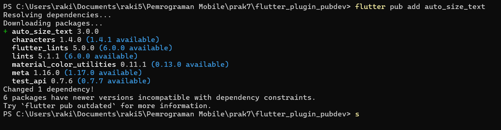
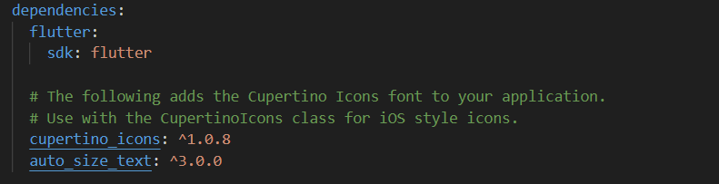
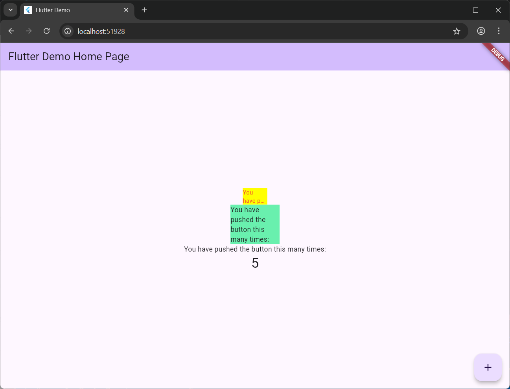

# flutter_plugin_pubdev

<h3>
Praktikum Menerapkan Plugin di Project Flutter
</h3>

**Langkah 2**
<br>
Tambahkan plugin auto_size_text menggunakan perintah berikut di terminal

```shell
flutter pub add auto_size_text
```



dependencies pada pubspec.yaml:

<br>

**Langkah 3: Buat file red_text_widget.dart**
<br>
Buat file baru bernama red_text_widget.dart di dalam folder lib lalu isi kode seperti berikut.

```dart
import 'package:flutter/material.dart';

class RedTextWidget extends StatelessWidget {
  const RedTextWidget({Key? key}) : super(key: key);

  @override
  Widget build(BuildContext context) {
    return Container();
  }
}
```

**Langkah 4: Tambah Widget AutoSizeText**
Masih di file red_text_widget.dart, untuk menggunakan plugin auto_size_text, ubahlah kode return Container() menjadi seperti berikut.

```dart
return AutoSizeText(
      text,
      style: const TextStyle(color: Colors.red, fontSize: 14),
      maxLines: 2,
      overflow: TextOverflow.ellipsis,
);
```

Setelah kode tersebut ditambahkan, terjadi error karena:
<br>

- Library auto_size_text belum diimport
- Parameter text belum ditambahkan pada class

Maka setelah diperbaiki kode menjadi:

```dart
import 'package:flutter/material.dart';
import 'package:auto_size_text/auto_size_text.dart';

class RedTextWidget extends StatelessWidget {
  final String text;
  const RedTextWidget({Key? key, required this.text}) : super(key: key);

  @override
  Widget build(BuildContext context) {
    return AutoSizeText(
      text,
      style: const TextStyle(color: Colors.red, fontSize: 14),
      maxLines: 2,
      overflow: TextOverflow.ellipsis,
    );
  }
}
```

**Langkah 6: Tambahkan widget di main.dart**
Buka file main.dart lalu tambahkan di dalam children: pada class \_MyHomePageState

```dart
Container(
   color: Colors.yellowAccent,
   width: 50,
   child: const RedTextWidget(
             text: 'You have pushed the button this many times:',
          ),
),
Container(
    color: Colors.greenAccent,
    width: 100,
    child: const Text(
           'You have pushed the button this many times:',
          ),
),
```

Hasil running:


<h3>
Tugas Praktikum
</h3>

2. Jelaskan maksud dari langkah 2 pada praktikum tersebut!
   <br>Jawab: langkah tersebut menambahkan plugin auto_size_text dengan menggunakan perintah flutter

3. Jelaskan maksud dari langkah 5 pada praktikum tersebut!
   <br>Jawab: Langkah tersebut menambahkan variabel dan parameter text untuk ditampilkan dengan widget RedTextWidget

4. Pada langkah 6 terdapat dua widget yang ditambahkan, jelaskan fungsi dan perbedaannya!
   <br>Jawab: Pada widget pertama dibuat container dengan child turunan dari class RedTextWidget, sedangkan widget kedua hanya menggunakan child text biasa

5. Jelaskan maksud dari tiap parameter yang ada di dalam plugin auto_size_text

   | Parameter             | Tipe Data        | Deskripsi                                                                                                                       |
   | --------------------- | ---------------- | ------------------------------------------------------------------------------------------------------------------------------- |
   | `text`                | `String`         | Teks yang akan ditampilkan dan diatur ukurannya secara otomatis.                                                                |
   | `key`                 | `Key?`           | Kunci unik untuk widget, berguna dalam manajemen state atau identifikasi widget.                                                |
   | `style`               | `TextStyle?`     | Gaya teks seperti warna, font, tebal, miring, dll.                                                                              |
   | `minFontSize`         | `double`         | Ukuran font minimum (default: `12.0`). Jika teks masih tidak muat, akan dipotong.                                               |
   | `maxFontSize`         | `double`         | Ukuran font maksimum (default: `double.infinity`).                                                                              |
   | `stepGranularity`     | `double`         | Langkah penurunan ukuran font setiap kali teks disesuaikan (default: `1.0`). Semakin kecil, semakin halus penyesuaiannya.       |
   | `presetFontSizes`     | `List<double>?`  | Daftar ukuran font yang telah ditentukan untuk dicoba secara berurutan. Mengabaikan `minFontSize` dan `maxFontSize` jika diset. |
   | `group`               | `AutoSizeGroup?` | Mengelompokkan beberapa `AutoSizeText` agar semua teks dalam grup memiliki ukuran font yang sama.                               |
   | `textAlign`           | `TextAlign?`     | Menentukan perataan teks (`left`, `center`, `right`, `justify`, dll).                                                           |
   | `textDirection`       | `TextDirection?` | Arah teks, misalnya `TextDirection.ltr` atau `TextDirection.rtl`.                                                               |
   | `locale`              | `Locale?`        | Locale teks (misal: `Locale('id', 'ID')`).                                                                                      |
   | `softWrap`            | `bool?`          | Jika `true`, teks akan dibungkus ke baris berikutnya bila terlalu panjang.                                                      |
   | `wrapWords`           | `bool`           | Menentukan apakah kata akan dibungkus atau dipotong di tengah (default: `true`).                                                |
   | `overflow`            | `TextOverflow?`  | Menentukan perilaku saat teks melebihi batas (misal: `ellipsis`, `fade`, `clip`).                                               |
   | `overflowReplacement` | `Widget?`        | Widget pengganti yang ditampilkan jika teks tidak muat sama sekali.                                                             |
   | `maxLines`            | `int?`           | Jumlah maksimum baris teks. Jika `null`, jumlah baris tidak terbatas.                                                           |
   | `textScaleFactor`     | `double?`        | Faktor skala ukuran teks, mengikuti pengaturan aksesibilitas pengguna jika tidak diset.                                         |
   | `semanticsLabel`      | `String?`        | Label alternatif untuk pembaca layar (accessibility).                                                                           |
   | `strutStyle`          | `StrutStyle?`    | Menentukan tinggi baris dan jarak antar teks.                                                                                   |
