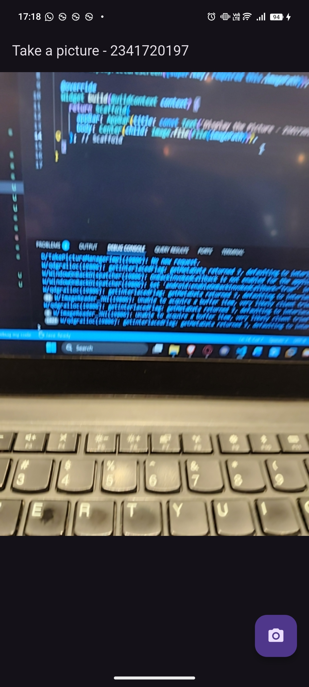
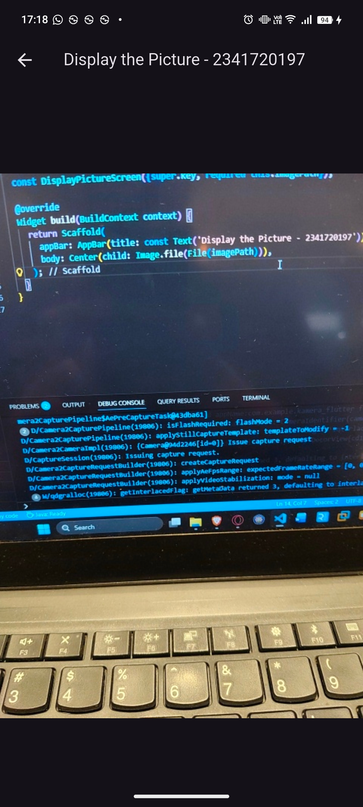

# kamera_flutter

# Praktikum 1: Mengambil Foto dengan Kamera di Flutter

Hasil takepicture_screen:

Hasil displaypicture_screen:

# Praktikum 2: Membuat photo filter carousel

Hasil filter carousel:
<video controls src="Screenrecording_20251206_173701.mp4" title="Title"></video>

# Tugas Praktikum

Gabungkan hasil praktikum 1 dengan hasil praktikum 2 sehingga setelah melakukan pengambilan foto, dapat dibuat filter carouselnya!

<video controls src="Screenrecording_20251206_175157.mp4" title="Title"></video>

Jelaskan maksud void async pada praktikum 1? 
Jawab: void berarti tidak memiliki nilai return, async berarti fungsi dapat berjalan di latar belakang
 

Jelaskan fungsi dari anotasi @immutable dan @override ? 
Jawab: @immutable digunakan untuk menandai bahwa semua field pada class tersebut harus final, sedangkan @override adalah anotasi yang digunakan ketika kita menimpa (override) method dari superclass atau interface.
 
